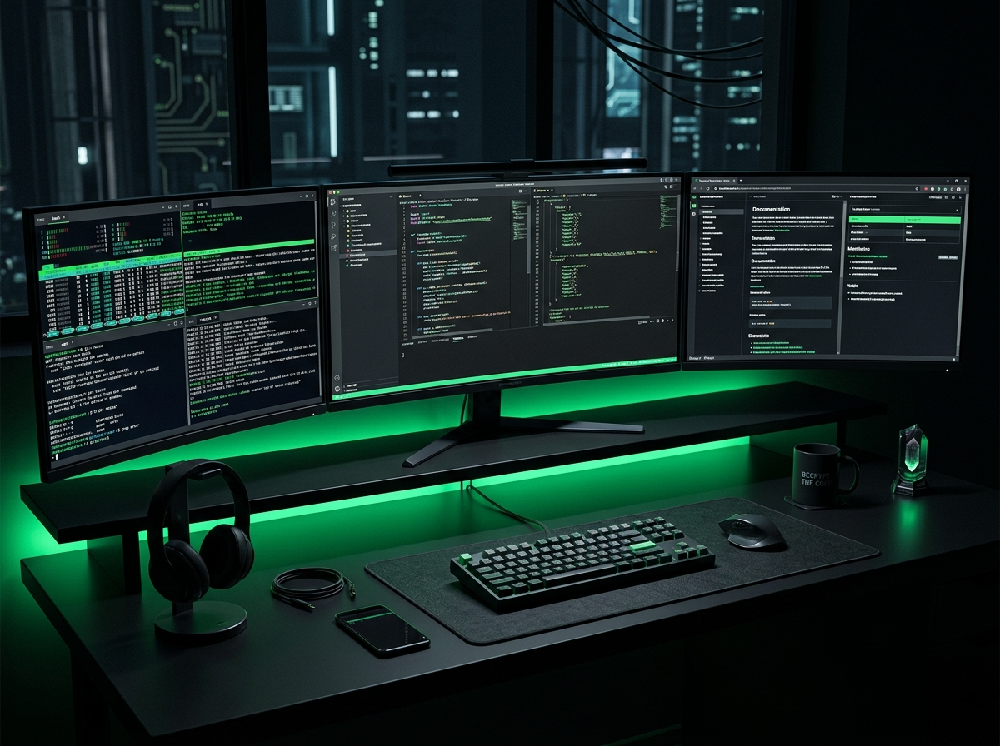

<div align="center">
  
</div>

<div align="center">
  
  &nbsp;
  <a href="https://github.com/Sanidhyanegi07?tab=followers">
    
  </a>
  &nbsp;
  <a href="https://github.com/Sanidhyanegi07?tab=stars">
    
  </a>
</div>

<br/>

<div align="center">
  
</div>

<br/>

## 👨‍💻 &nbsp; About Me



> *Crafting software that is both optimal and highly maintainable.*

- 🎓 &nbsp; **Computer Science** student passionate about systems engineering
- 🔬 &nbsp; Deep into **Data Structures & Algorithms** and **Java internals**
- ⚙️ &nbsp; Building robust backends with **C++** and scalable UIs with **React**
- 📐 &nbsp; Core belief: *clean, decoupled code over quick hacks — always*
- 🌱 &nbsp; Learning **System Design** and **Distributed Computing**
- 🎯 &nbsp; Bridging theory and production-ready development

<br clear="both"/>

---

## 🎯 &nbsp; What I Do

<table>
<tr>
<td width="50%" valign="top">

### ⚙️ &nbsp; Systems Engineering
Building **robust, decoupled architectures** with C++ and Java. Focus on performance optimization, memory management, and clean code principles that stand up under scale.

</td>
<td width="50%" valign="top">

### 🌐 &nbsp; Frontend Architecture
Crafting **responsive, state-driven UIs** with React JS. Emphasis on component modularity, scalable frontend patterns, and delivering polished user experiences.

</td>
</tr>
<tr>
<td width="50%" valign="top">

### 🧠 &nbsp; Algorithm Design
Rigorous problem-solving with focus on **optimal data structure selection**, time/space complexity analysis, and building strong algorithmic intuition.

</td>
<td width="50%" valign="top">

### 📐 &nbsp; Object-Oriented Design
Applying **SOLID principles** and design patterns to create maintainable, extensible software systems with strict access control and clean state management.

</td>
</tr>
</table>

---

## 💻 &nbsp; Tech Stack

<div align="center">

**`Languages & Core Logic`**

<br/>


&nbsp;

&nbsp;


<br/><br/>

**`Architecture & Frontend`**

<br/>


&nbsp;

&nbsp;

&nbsp;


<br/><br/>

**`Systems & Tooling`**

<br/>


&nbsp;

&nbsp;

&nbsp;


</div>

---

## 🚀 &nbsp; Featured Projects

<table>
<tr>
<td width="50%" valign="top">

<h3 align="center">🧠 Algorithmic Telemetry Log</h3>
<div align="center">

`Java` `DSA`

</div>

Intensive algorithmic problem-solving — building intuition for optimal data structure selection and time/space complexity tradeoffs.

<div align="center">
<br/>
<a href="https://github.com/Sanidhyanegi07">

</a>
</div>

</td>
<td width="50%" valign="top">

<h3 align="center">🌐 Webathon / NIRVAN '26</h3>
<div align="center">

`React` `Vite` `Frontend`

</div>

Frontend modularity, state management, and shipping responsive component-based UI under strict operational deadlines.

<div align="center">
<br/>
<a href="https://github.com/Sanidhyanegi07">

</a>
</div>

</td>
</tr>
<tr>
<td width="50%" valign="top">

<h3 align="center">⚙️ ComplexCalc Core Engine</h3>
<div align="center">

`C++` `Algorithms` `Architecture`

</div>

Scientific operations, complex-number math, and dynamic expression evaluation with strictly decoupled business logic.

<div align="center">
<br/>
<a href="https://github.com/Sanidhyanegi07">

</a>
</div>

</td>
<td width="50%" valign="top">

<h3 align="center">🔒 Academic Management System</h3>
<div align="center">

`C++17` `OOP`

</div>

Role-based user workflows with strict access control, session validation, eligibility logic, and consistent application state.

<div align="center">
<br/>
<a href="https://github.com/Sanidhyanegi07">

</a>
</div>

</td>
</tr>
</table>

---

## 🔥 &nbsp; GitHub Streak

<div align="center">
  <a href="https://git.io/streak-stats">
    
  </a>
</div>

---

## ⚡ &nbsp; Current Status

```text
🎯  Focus       →  Advanced React JS architecture, deep Java internals, rigorous DSA
📚  Learning    →  System design patterns, distributed computing fundamentals
🛠️  Building    →  Production-grade tools with clean, decoupled architectures
🔄  Reviewing   →  Auditing older implementations for structural integrity & performance
```

---

## 💬 &nbsp; Dev Quote

<div align="center">
  
</div>

---

## 📡 &nbsp; Let's Connect

<div align="center">

<a href="https://github.com/Sanidhyanegi07">
  
</a>
&nbsp;&nbsp;
<a href="https://www.linkedin.com/in/sanidhya-negi-49aa8a35a/">
  
</a>

<br/><br/>

*Open to collaborations, open-source contributions, and interesting engineering problems.*

</div>

<br/>

<div align="center">
  
</div>
