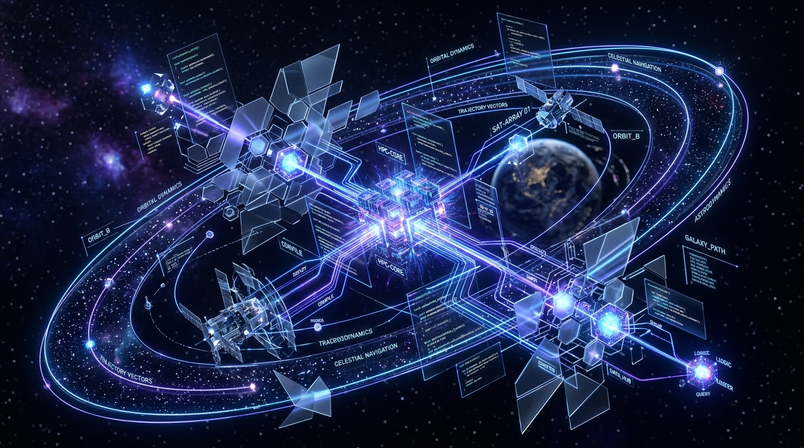

  
  
    
  
  # Sanidhya Negi 
  **Building resilient systems, structured logic, and robust applications.** 

---

### ✦ About Me

I'm a **B.Tech Computer Science student** writing mostly **Java** and **C++**. I care less about merely getting a program to compile, and more about what happens after — how the code is structured, where a piece of logic belongs, what happens when the input is wrong, and whether I can still make sense of it when I open it again a few weeks later.

Most of my work revolves around building robust **Qt desktop applications** or maintaining a running log of problems I've solved to get better at data structures, algorithms, and writing implementations that hold up once the logic scales.

---

### ✦ Engineering & Projects

| Project | Stack | Description |
| :--- | :--- | :--- |
| **ComplexCalc** | `C++`, `Qt Widgets` | A desktop calculator that grew past basic arithmetic — scientific operations, complex-number calculations, expression evaluation, a calculation history, and unit conversions, all inside one GUI. My first real attempt at strictly isolating interface, logic, and input handling. |
| **Attendance Management System** | `C++17`, `Qt` | A role-based academic tool with separate Admin, Teacher, and Student workflows. The interesting part isn't the screens, it's the rules underneath them: access control, attendance sessions, medical exemptions, eligibility logic, and keeping stored state consistent. |
| **NeetCode Submissions** | `Java` | An ongoing log of problem-solving work. I use it to get faster at choosing the right data structure early, reasoning about complexity, and writing solutions that are still readable on a second read. |
| **Webathon / NIRVAN '26** | `React`, `Vite`, `JS` | A web project built for a college technical event. Not my main focus, but a useful look at a different part of the stack, and what it takes to ship something under a strict deadline. |

---

### ✦ Technical Stack & Environment

**Core Languages:** Java, C++  
**Frameworks & Tools:** Qt, CMake, React, Vite  
**Environment:** Linux, VS Code, Git, GitHub  

> *"Java and C++ are what I reach for first. I've built desktop UIs with Qt, managed builds with CMake, and done most of my day-to-day work in Linux."*

---

### ✦ Current Focus

Right now, I am spending most of my time on deeper **Java**, stronger fundamentals in **object-oriented design**, and the early parts of **system design** — while trying to get better at reading code I wrote a while back and telling, honestly, whether it still holds up.

 

  

  <!-- Preserved from original readme -->
  

