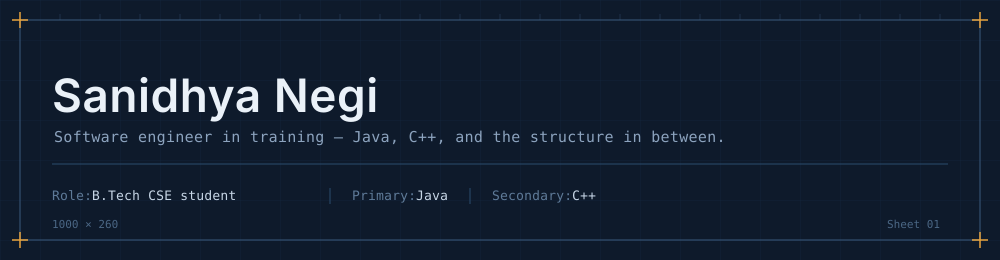

  

 

> **`> ./whoami`**
>
> I'm a Computer Science student focused on building robust systems from the ground up. Whether optimizing algorithms in `C++` or structuring scalable backends in `Java`, I treat coding as the ultimate puzzle—relying on clean logic and resilient architecture.

 

### `// CORE_STACK`

`C++` `C` `Java` `JavaScript` `React` `HTML5` `CSS3` `Git` `Linux` `CMake` `Qt`

 

### `// ENGINEERING_WORK`

| `ARCHITECTURE` | `DESCRIPTION` | `TECH` |
| :--- | :--- | :--- |
| [**Algorithmic Telemetry Log**](https://github.com/Sanidhyanegi07/neetcode-submissions) | Intensive algorithmic problem‑solving focused on optimal data structures and time/space complexity tradeoffs. | `Java` `DSA` |
| [**ComplexCalc Core Engine**](https://github.com/Sanidhyanegi07/ComplexCalc) | Scientific calculator engine supporting dynamic expression parsing with cleanly decoupled business logic. | `C++` `Math` |
| [**Academic Management System**](https://github.com/Sanidhyanegi07/Attendance-Management-System) | Enterprise-style application featuring strict role‑based access control and robust session management. | `C++17` `OOP` |
| [**Webathon / NIRVAN '26**](https://github.com/Sanidhyanegi07/webathon) | Modular and highly responsive frontend architecture built for a high-traffic college technical event. | `React` `Vite` |

 

### `// SYSTEM_TELEMETRY`

  

 

  
  &nbsp;
  

 

  <i>"Simplicity is prerequisite for reliability." — Edsger W. Dijkstra</i>

